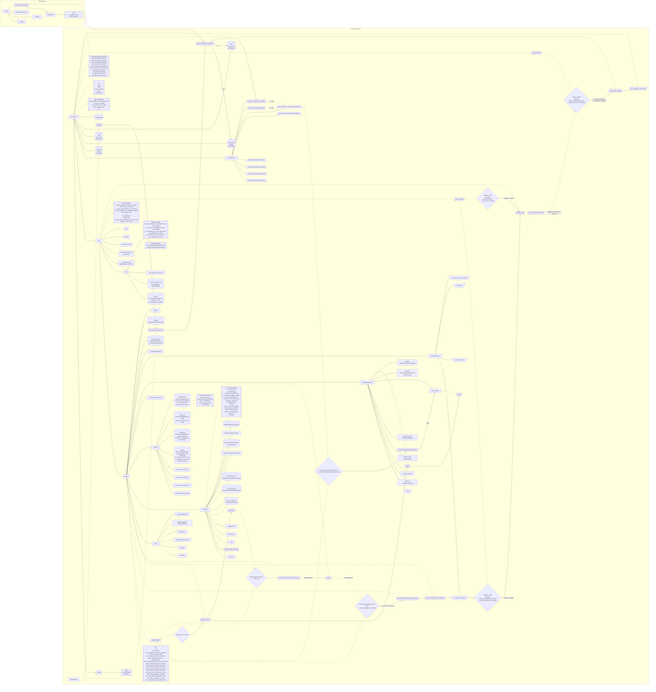

# SnarkOS Diagaram

This is a work in progress Diagram of how SnarkOS works

```mermaid
graph LR
    subgraph ConsensusService
        A[Consensus] -->B(Ledger)
        A --- C[BFT]
        A --- D[PrimarySender]
        A --- E[("Solutions <br/> Queue<br/>[IndexMap]")]
        A --- F[("Transactions <br/> Queue <br/> [IndexMap]")]
        A --- G[("Seen <br/> Solutions <br/>[LRUCache]")]
        A --- H[("Seen <br/> Transactions<br/>[LRUCache]")]
        A --- I[("Vec[Handles]")]
        A -.- BFTMethods[["--BFT METHODS--<br/>start_handlers(ConsensusReciever)<br/>process_bft_subdag<br/>try_advance_to_next_block<br/>reinsert_transmission<br/>run"]]
        A -.- Other[[<br/>bft<br/>ledger<br/>new<br/>primary_sender<br/>spawn<br/>shut_down]]
        A -.- TransmissionMethods[[--TRANSMISSION METHODS--<br/>add_unconfirmed_solution<br/>add_unconfirmed_transaction<br/>num_unconfirmed_ratifications<br/>num_unconfirmed_solutions<br/>num_unconfirmed_transactions<br/>num_unconfirmed_transmissions<br/>unconfirmed_ratifications<br/>unconfirmed_solutions<br/>unconfirmed_transactions<br/>unconfirmed_transmissions]]
        A -.- AMethods1[[start_handlers]] -.- ATask1{"ASYNC_TASK<br/>(Repeats)<br/>await on ConsensusReciever<br/>consensus_receiver.rcv().await"}--committed_subdag, transmissions, callback--> AMethods2
        A -.- AMethods2[[process_bft_subdag]]
        A -.- AMethods3[[try_advance_to_next_block]]
        A -.- AMethods4[[add_unconfirmed_transaction]]
        AMethods2 ---> AMethods3
        AMethods4--insert--> F
        AMethods4--put--> H
        AMethods4 ---> Y
        B --- J[[Ledger <br/>Access/Update <br/>Methods]]
        C --- K(Primary)
        K -.- KM[[new<br/>run<br/>start_handlers<br/>check_proposed_batch_for_expiration<br/>ensure_is_signing_round<br/>fetch_missing_previous_certificates<br/>fetch_missing_transmissions<br/>propose_batch<br/>insert_missing_transmissions_into_workers<br/>reinsert_transmissions_into_workers<br/>process_batch_propose_from_peer<br/>process_batch_signature_from_peer<br/>process_batch_certificate_from_peer<br/>process_batch_solution_from_peer<br/>process_batch_certificate_from_ping<br/>store_and_broadcast_certificate<br/>sync_with_batch_header_from_peer<br/>sync_with_certificate_from_peer<br/>try_to_increment_to_the_next_round]]
        K -.- KM1[[start_handlers]]
        K -.- KM2[[process_batch_signature_from_peer]]
        K -.- KM3[[store_and_broadcast_certificate]]-->AEC1-->BFTBFTTask1
        K -.- KM4[[propose_batch]]
        K -.- KM5[[process_batch_propose_from_peer]]
        KM1 -.- KT1{"Process batch signatures from peers.<br/>rx_batch_signature.recv().await"}
        KM1 -.- KT2{"Process unconfirmed transactions.<br/>rx_unconfirmed_transactions.recv().await"}
        KM1 -.- KT3{"Propose batch to peers"}
        KM1 -.- KT4{"process batch proposals from peers"}
        KM2 --> KM3
        KT1--peer ip, batch_signature--> KM2
        KT3-->KM4
        KT4-->KM5
        C --- L(Dag)
        C --- M("LeaderCertificate <br/>[Option(Batch Certificate)]")
        C --- N("LeaderCertificateTimer<br/>[AtomicI64]")
        C --- O(ConsensusSender)
        C --- P(Handles)
        C --- Q(Lock)
        D --- R[/"mpsc_sender:tx_batch_propose"\]
        D --- S[/mpsc_sender:tx_batch_signature\]
        D --- T[/"mpsc_sender:tx_batch_certified"\]
        D --- U[/"mpsc_sender:tx_primary_ping"\]
        D --- V[/"mpsc_sender:tx_unconfirmed_solution"\]
        D --- W[/"mpsc_sender:tx_unconfirmed_transaction"\]-.->KT2
        D --- X[[send_unconfirmed_solution]]
        D --- Y[[send_unconfirmed_transaction]]
        Y -.Tx, TxID.- W
        X -.Sol,SoId .- V
        K --- Z[Sync]
        K --- AA[Gateway]
        K --- AB[Storage]
        K --- AC["Arc[dyn LedgerService]"]
        K --- AD["Arc[Array[Worker]]"]
        AD --- WorkerM1["id: u8"]
        AD --- WorkerM2["gateway: Arc[dyn[Transport]]"]
        AD --- WorkerM3["storage: Storage"]
        AD --- WorkerM4["ledger: Arc[dyn LedgerService]"]
        AD --- WorkerM5["proposed_batch: Arc[ProposedBatch]"]
        AD --- WorkerM6["ready: Ready"]
        AD --- WorkerM7["pending: Arc[Pending[TransmissionID, Transmission]]"]
        AD --- WorkerM8["handles: Arc[Mutex[Vec[JoinHandle]]]"]
        AD -.- WorkerMethod1[["process_unconfirmed_transaction"]]
        WorkerM6 -.-> WorkerM6M1[[drain]]
        WorkerMethod1 --insert--> WorkerM6
        AD -.- WorkerMethod2[[drain]]-->WorkerM6M1
        KT2 ---> WorkerMethod1
        KM4 --> WorkerMethod2
        K --- AE["Arc[BFTSender]"]
        AE --- AEC1[\"tx_primary_certificate"/]
        AE --- AEC2[\"tx_primary_round"/]
        AE --- AEC3[\"tx_sync_bft"/]
        AE --- AEC4[\"tx_sync_bft_dag_at_bootup"/]
        K --- AF["Arc[ProposedBatch]"]
        K --- AG[("batch_proposals<br/>Arc[Hashmap[Address:(round,Field,Signature)]]")]
        K --- AH[("handles<br/>Arc[Mutex[Vec[JoinHandles]]]")]
        K --- AI["Tmutex<u64>"]
        Z --- AJ["Gateway"]
        Z --- AK["Storage"]
        Z --- AL["Arc[dyn LedgerService]"]
        Z --- AM["BlockSync"]
        Z --- AN["Arc[Pending[Field, BatchCertificate]]"]
        Z --- AO["Arc[Array[Worker]]"]
        AA --- AP["Account"]
        AA --- AQ[["Arc[dyn LedgerService]"]]
        AA --- AR["TCP"]
        AA --- AS["Arc[Cache]"]
        AA --- AT["Arc[Resolver]"]
        AA --- AU[("trusted_validators<br/>IndexSet[SockerAddr]")]
        AA --- AV[("connected_peers<br/>Arc[Mutex[IndexSet[SockerAddr]]]")]
        AA --- AW[("connecting_peers<br/>Arc[Mutex[IndexSet[SockerAddr]]]")]
        AA --- AX["Arc[OnceCell[PrimarySender]"]
        AA --- AY[("Arc[OnceCell[IndexMap[u8, WorkerSender]]")]
        AA --- AZ["Arc[OnceCell[SyncSender]"]
        AA --- BA[("Arc[Mutex[Vec[JoinHandle]]]")]
        AA -.- BB[["is_connected_address<br/>is_connected_ip<br/>is_connecting_ip<br/>is_authorized_validator_ip<br/>is_authorized_validator_address<br/>max_connected_peers<br/>number_of_connected_peers<br/>connected_addresses<br/>connected_peers<br/>connect<br/>check_connection_attempt<br/>ensure_peer_is_allowed<br/>insert_connected_peer<br/>remove_connected_peer<br/>send_inner<br/>inbound"]]
        AA -.- GatewayMethod1[["broadcast"]]
        AA -.- GatewayMethod2[["send"]]
        KM4 --> GatewayMethod1
        KM5 --BatchSignature--> GatewayMethod2
        GatewayMethod1 -.-> KT4
        GatewayMethod2 -.BatchSignature.-> KT1
        L --- BC[("graph<br/>in memory certificates that comprise the dag<br/>BtreeMap[u64, HashMap<Address, BatchCertificate]")]
        L --- BD[("recent_committed_ids<br/>BtreeMap[u64, IndexSet[Field]")]
        L --- BE["last_commited_round: u64"]
        L -.- BM[["DAG MODIFIERS<br/>commit(certificate:BatchCertificate)<br/>insert(certificate:BatchCertificate)"]]
        L -.- BN[["DAG READERS<br/>contains_certificate_in_round(round:u64, cert_id: Field)<br/>is_recently_committed(round: u64, cert_id:Field)<br/>get_certificate_for_round_with_author<br/>get_certificate_in_round<br/>get_certificates_for_round_with_id<br/>get_certificates_for_round"]]
        L -.- BM[["DAG MODIFIERS<br/>commit(certificate:BatchCertificate)<br/>insert(certificate:BatchCertificate)"]]
        C -.- BFTBFTMethods[["BFT METHODS<br/>compute_stake_for_leader_certificate<br/>commit_leader_certificate<br/>is_even_round_ready_for_next_round<br/>is_leader_quorum_or_nonleader_available<br/>order_dag_with_dfs<br/>run<br/>start_handlers<br/>update_dag<br/>update_leader_certificate_to_even_round<br/>update_to_next_round"]]
        C -.- BFTBFTMethods1[[start_handlers]] -.- BFTBFTTask1{"ASYNC_TASK<br/>(Repeats)<br/>Process Certificate from primary<br/>rx_primary_certificate.recv().await"}--certificate, callback--> BFTBFTMethods2
        BFTBFTMethods1 -.- BFTBFTTask2{"ASYNC_TASK<br/>(Repeats)<br/>Request sync BFT<br/>rx_sync_bft.recv().await"}--certificate, callback--> BFTBFTMethods2
        C -.- BFTBFTMethods2[[update_dag]]-.-> BFTBFTMethods3[[commit_leader_certificate]]-.subdag, transmissions, callback.-> ATask1
        AB --- BQ("current_height: AtomicU32")
        AB --- BR["current_round: AtomicU64"]
        AB --- BS["gc_round: AtomicU64"]
        AB --- BT["max_gc_rounds: u64"]
        AB --- BU[("rounds<br/>RwLock[IndexMap[u64, IndexSet[(Field, Field, Address)]]<br/>The map of `round` to a list of `(certificate ID, batch ID, author)` entries.")]
        AB --- BV[("certificates<br/>RwLock[IndexMap[Field, BatchCertificate]]<br/>The map of `certificate ID` to `certificate`.")]
        AB --- BW[("batch_ids<br/>RwLock[IndexMap[Field, u64]]<br/>The map of `batch ID` to `round`.")]
        AB --- BX[("transmissions<br/>Arc[dyn StorageService]<br/>The map of `transmission ID` to `(transmission, certificate IDs)` entries.")]
        BX -.- BY[["contains_transmission<br/>get_transmission<br/>find_missing_transmissions<br/>insert_transmissions<br/>remove_transmissions<br/>as_hashmap"]]
        InboundTrait -.- InboundTraitMethod1[[inbound]]
        InboundTrait -.- InboundTraitMethod2[[unconfirmed_transaction]]
        InboundTraitMethod1 ---> InboundTraitMethod2
        InboundTraitMethod2 ---> AMethods4
    end
    subgraph RESTService
        REST --- Ledger
        REST --- Routing
        REST --- RESTA["Option[Consensus]"]
        Routing -.- propagate
        REST -.- RESTMethod1[[transaction_broadcast]]
        RESTMethod1 ---> propagate ---> send[[send<br/>propagates to all connected peers]] -.-> InboundTraitMethod1
        RESTMethod1 ---> AMethods4
    end
```
